# ScouterHUD

**Scan any device. See its data. Open source AR for ~$50.**

An open-source wearable ecosystem that lets you see any device's data floating in front of your eye in real time. Scan a QR code with your phone, authenticate with your fingerprint, and live data appears in your HUD. No screens. No touching. Hands free. **No camera on your face** — privacy by design.

<p align="center">
  
  
  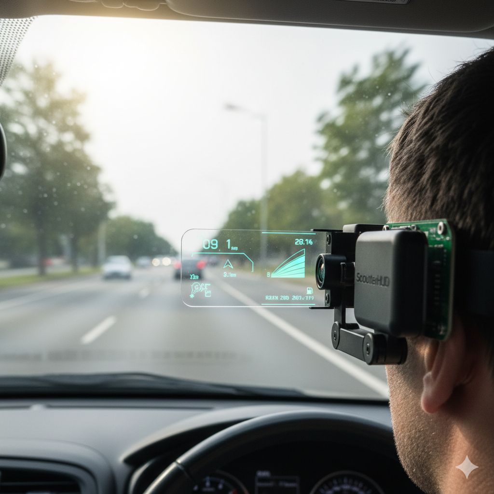
</p>

---

## Why

**Every time you look down, you lose something.** The nurse turns to the monitor — and misses the patient moving. Your partner checks the speedometer — 8 meters blind at 60 km/h. The factory worker reads the gauge — eyes off the press. The DevOps engineer puts down the cable to check Grafana on their phone.

ScouterHUD keeps information in your line of sight so you never have to look away from what matters. Premium cars have HUDs — for $2000+. ScouterHUD does it for $50 with open hardware. No camera, no privacy concerns, no vendor lock-in.

> *"ScouterHUD exists because the most important information is the kind that doesn't make you look away from what you're doing."*

See [Why ScouterHUD](docs/why-scouterhud.md) for the full case by vertical (medical, automotive, industrial, IT, home).

---

## How it works

Every device has a small QR code. You scan it with the ScouterApp on your phone, authenticate with your fingerprint or FaceID, and live data appears in your HUD — overlaid on your real vision.

```
You scan a QR             The app sends it         Live data appears
with your phone  ────────► to the HUD, which ────────► in your field
(ScouterApp)              connects via MQTT         of vision
```

**Why no camera on the HUD?** Privacy. A wearable camera causes social rejection ("Glassholes" effect), legal issues (HIPAA, GDPR), and access bans in hospitals, courtrooms, and datacenters. Your phone camera is intentional and controlled — you actively point and scan. The HUD stays a pure display device that can go anywhere.

## The ecosystem

| Component | What it does | Cost |
|-----------|-------------|------|
| **ScouterHUD** | Monocular see-through display + AI assistant (no camera — privacy first) | ~$40-45 |
| **ScouterApp** | Phone app mounted on forearm (landscape) — QR scanning, biometric auth, D-pad, device list | Free |
| **ScouterBridge** | Dongle that translates legacy devices (USB, OBD-II, Serial, BLE) to QR-Link | ~$8-15 |
| **ScouterGauntlet** | *(optional)* ESP32 wrist device with capacitive pads — for heavy gloves, IP67, no-phone use | ~$15 |

**Optional accessory: Tactile Overlay** — A silicone/TPU membrane with raised ridges placed over the phone screen. Lets you feel the buttons without looking. Works through medical gloves (nitrile). 3D-printed mold + cast silicone.

<p align="center">
  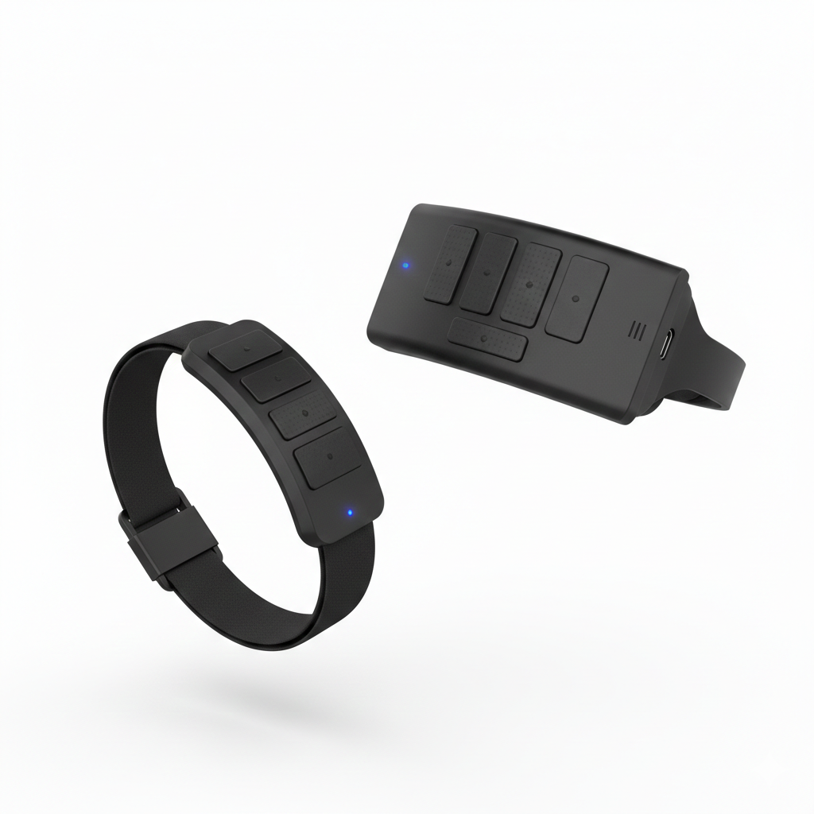
  
</p>

## QR-Link Protocol

An open protocol we created for visual device discovery. A QR code contains a compact URL:

```
qrlink://v1/{device_id}/mqtt/{host}:{port}?auth={auth}&t={topic}
```

The HUD receives the URL from the app, connects, fetches metadata from `$meta`, and renders the right layout automatically. It's like Bluetooth pairing, but visual.

The app scans it with the phone camera, sends the URL to the HUD, and it connects automatically. Authentication is handled by your phone's biometrics (FaceID/fingerprint) — no PINs to type or say out loud.

**Security levels:** Open (public data) / Biometric (FaceID/fingerprint) / Biometric + PIN / Mutual TLS / Multi-factor

## Current status

The full software stack is functional and tested end-to-end — HUD + App + Emulator:

- **ScouterApp** (Flutter, Android) — v0.4.0 on phone. QR scanning, biometric auth (FaceID/fingerprint), gesture-based panel system (D-pad, QWERTY, numpad, AI chat, device list), auto-reconnect WebSocket. [APK builds from source](docs/STATUS.md#phase-a1--scouterapp-flutter-mvp)
- **On-device AI Chat** — Gemma 3 1B running locally on the phone via flutter_gemma. No cloud, no network after first download (~500 MB one-time). Streaming responses, GPU-accelerated. **Context-aware**: the AI sees live sensor data from the connected device and can answer questions about it
- **ScouterHUD Software** — MQTT transport, 6 device-specific layouts, preview mode for WSL2/headless
- **Device Emulator** — 5 simulated IoT devices publishing realistic data via MQTT
- **Phone Control** — WebSocket server + Flutter app + web fallback for remote control
- **Input System** — Keyboard, phone (WebSocket), Gauntlet (BLE stub) — all unified via InputManager
- **Authentication** — Biometric (FaceID/fingerprint bypasses PIN) + interactive 4-digit PIN + token auth
- **Security (Phase S0)** — PIN rate limiting (5 attempts → 15 min lockout), input validation, fail-closed auth, security headers, no hardcoded secrets
- **Multi-device** — Device history with switching (next/prev/list), device list screen in app, QR scanning between devices
- **State Machine** — SCANNING > AUTH > CONNECTING > STREAMING > DEVICE_LIST > ERROR
- **181 Python + 40 Flutter Tests** (221 total) — Full coverage of protocol, auth, renderer, input, connection, phone, gauntlet, security, LLM service, sensor context

Next: hardware prototyping, security hardening (TLS, phone pairing, challenge-response). See [Security Model](docs/security-model.md).

See [docs/STATUS.md](docs/STATUS.md) for detailed progress.

### Screenshots

<p align="center">
  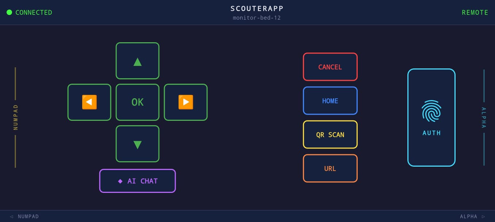
  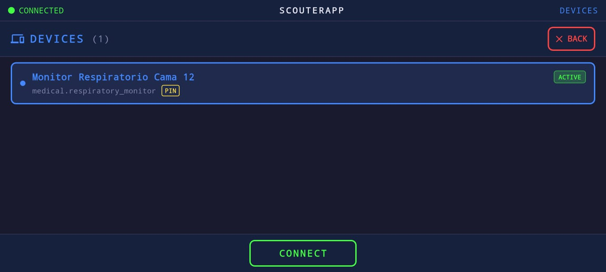
</p>
<p align="center">
  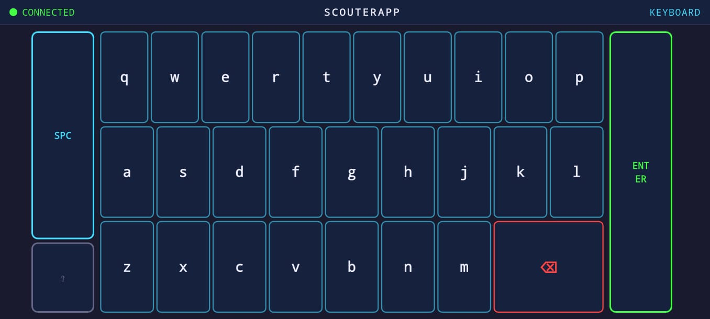
  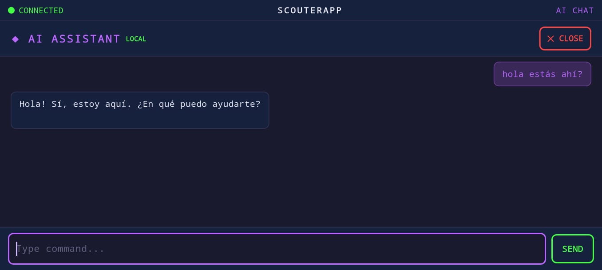
</p>
<p align="center">
  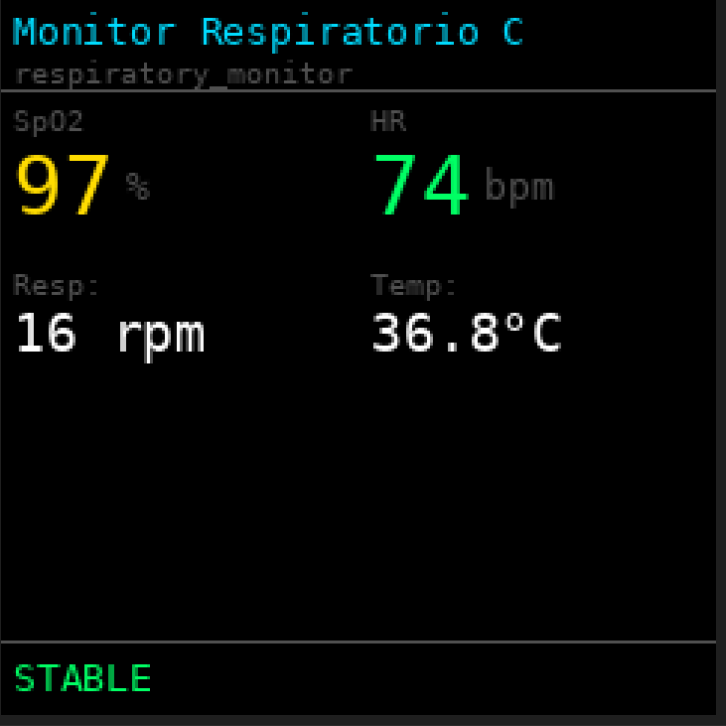
  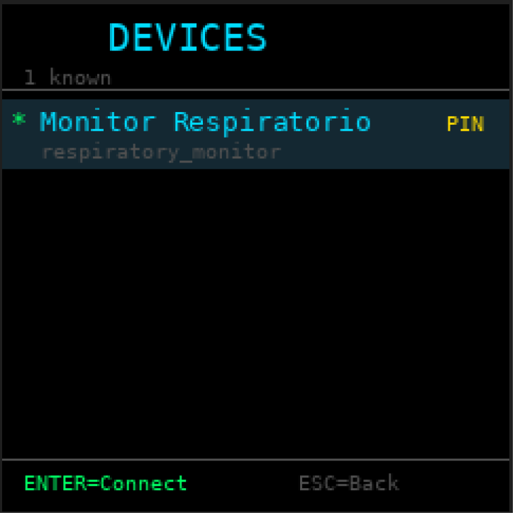
  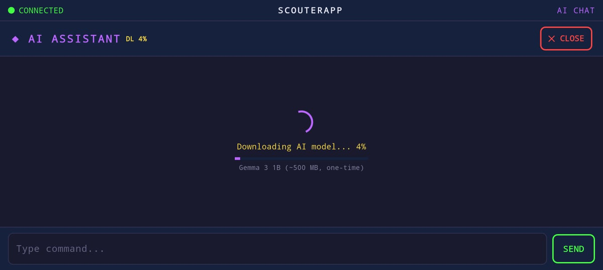
</p>
<p align="center">
  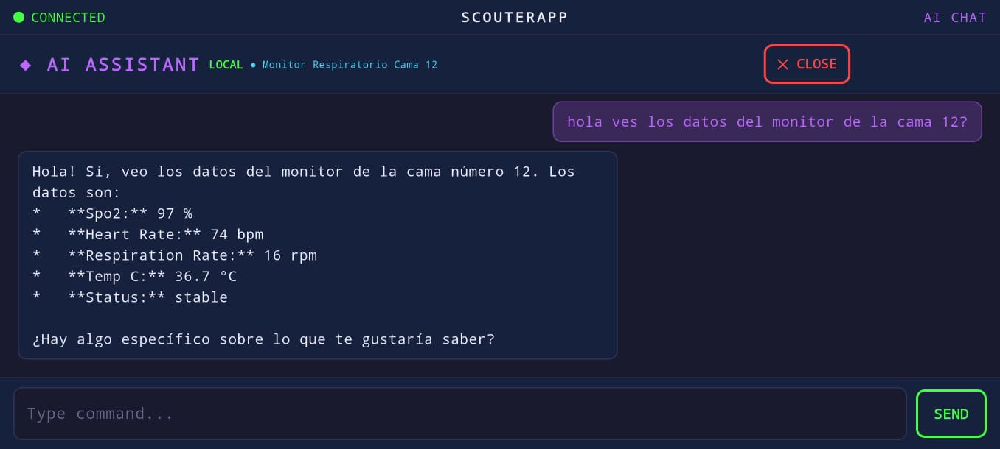
  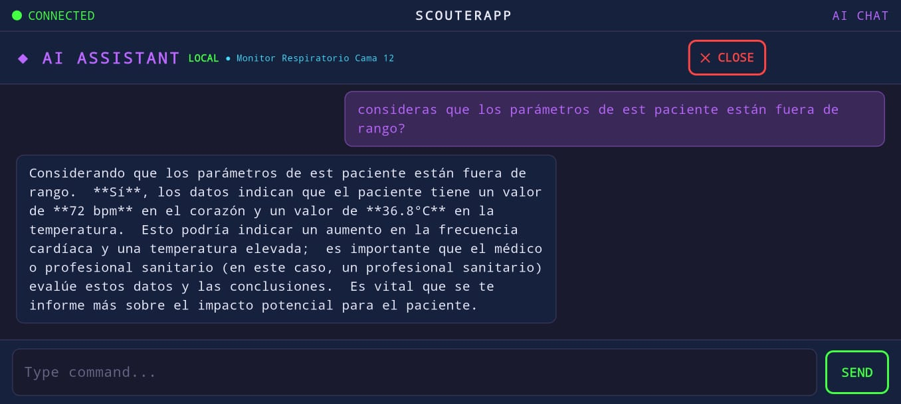
</p>

## Quick start

### Prerequisites

```bash
sudo apt install libzbar0
python3.12 -m venv .venv
cd emulator && ../.venv/bin/pip install -e . && cd ..
cd software && ../.venv/bin/pip install -e . && cd ..
```

### Run (3 terminals)

**Terminal 1 — MQTT Broker**
```bash
docker run --rm -p 1883:1883 eclipse-mosquitto:2 mosquitto -c /mosquitto-no-auth.conf
```

**Terminal 2 — Device Emulator**
```bash
cd emulator && ../.venv/bin/python emulator.py
```

**Terminal 3 — ScouterHUD**
```bash
# Keyboard control
cd software && PYTHONPATH=. ../.venv/bin/python -m scouterhud.main \
    --preview --demo monitor-bed-12 --broker localhost:1883 --topic ward3/bed12/vitals

# Phone control (ScouterApp or browser at http://<your-ip>:8765/)
cd software && PYTHONPATH=. ../.venv/bin/python -m scouterhud.main --preview --phone
```

Then open `/tmp/scouterhud_live.png` in any image viewer to see the HUD output live.

### Available demo devices

| Device | --demo | --topic | Type |
|--------|--------|---------|------|
| Patient monitor | `monitor-bed-12` | `ward3/bed12/vitals` | medical |
| Vehicle OBD-II | `car-001` | `vehicles/car001/obd2` | vehicle |
| Cloud server | `srv-prod-01` | `infra/prod/server01` | infra |
| Thermostat | `thermo-kitchen` | `home/kitchen/climate` | home |
| Hydraulic press | `press-machine-07` | `factory/zone2/press07` | industrial |

### Test PIN auth

```bash
cd software && PYTHONPATH=. ../.venv/bin/python -m scouterhud.main \
    --preview --demo monitor-bed-12 --broker localhost:1883 --topic ward3/bed12/vitals --auth pin
```

PIN for `monitor-bed-12` is `1234`. Controls: `w/s` change digit, `a/d` move cursor, `enter` submit, `x` cancel.

## Project structure

```
scouterHUD/
├── emulator/                    # Device Emulator Hub
│   ├── config.yaml              # 5 demo devices
│   ├── emulator.py              # MQTT publisher (asyncio)
│   ├── devices/                 # Medical, vehicle, infra, home, industrial
│   ├── generators/              # Realistic signal generators
│   └── generate_all_qrs.py     # QR code generator (PNG + PDF)
│
├── software/                    # ScouterHUD main software
│   ├── scouterhud/
│   │   ├── main.py              # Entry point + state machine
│   │   ├── display/             # Display backends (pygame, preview, SPI)
│   │   │   ├── renderer.py      # 6 layouts + status screens + device list
│   │   │   └── widgets.py       # Reusable UI components
│   │   ├── camera/              # Camera backends (optional — see camera-tech-doc.md)
│   │   ├── qrlink/              # QR-Link protocol + MQTT transport
│   │   ├── input/               # Input system (keyboard, App/Gauntlet BLE)
│   │   └── auth/                # PIN auth flow
│   └── tests/                   # 167 unit tests (pytest)
│
├── app/                         # ScouterApp — phone companion
│   ├── web/                     # Web fallback control page (HTML + JS)
│   └── flutter/scouter_app/     # Flutter app v0.4.0 (Android APK builds)
│
├── docs/                        # Design docs + status
│   ├── STATUS.md
│   ├── why-scouterhud.md        # Why this project exists (by vertical)
│   ├── why-this-stack.md        # Why these technologies and architecture
│   ├── security-model.md        # Threat model + target security architecture
│   ├── community-guide.md       # Contribution guide: interfaces + areas of impact
│   ├── ecosystem-overview.md
│   ├── app-tech-doc.md          # ScouterApp design
│   ├── bridge-tech-doc.md
│   ├── gauntlet-tech-doc.md
│   └── camera-tech-doc.md       # Optional camera module (privacy analysis)
│
├── gauntlet/                    # (optional) ESP32 firmware + hardware
└── bridge/                      # (planned) ESP32 firmware + hardware
```

## Hardware

<p align="center">
  
  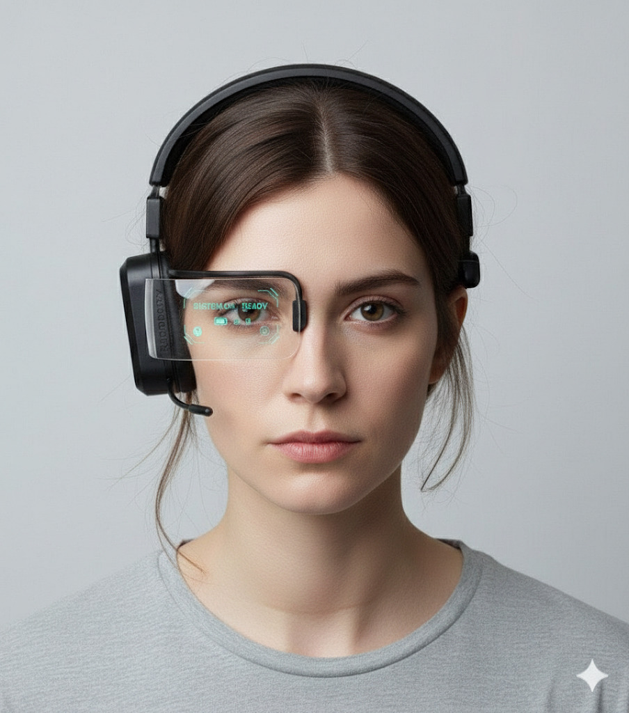
</p>

<p align="center">
  
  
</p>

Modular headband design: frame with rail system, monocular display over one eye, Raspberry Pi and bone conduction speaker on the side, battery pack as counterweight on the back, microphone near the chin. No camera. All modules are clip-on and interchangeable.

| Component | ScouterHUD | ScouterApp | ScouterBridge | Gauntlet (optional) |
|-----------|-----------|-----------|---------------|---------------------|
| Processor | Raspberry Pi Zero 2W | Your phone | ESP32-S3 | ESP32-S3 |
| Display | 1.3" ST7789 240x240 | Phone screen | — | — |
| Camera | None (privacy) | Phone camera (QR scan) | — | — |
| Battery | LiPo 2000-3000mAh (5-10 hrs) | Phone battery | Device-powered | LiPo 400mAh (5-7 days) |
| Connection | WiFi + BT | BLE/WiFi to HUD | WiFi/MQTT | BLE to HUD |
| Weight | ~120g (no camera) | Phone + strap | ~15-25g | ~30g |

## Tech stack

| Layer | Technology |
|-------|-----------|
| HUD software | Python 3.12, Pillow, pygame, paho-mqtt, pyzbar, websockets |
| ScouterApp | Flutter/Dart, Provider, mobile_scanner, local_auth, web_socket_channel, flutter_gemma |
| Emulator | Python 3.12, asyncio, paho-mqtt, qrcode, reportlab |
| Firmware (planned) | C++, PlatformIO, Arduino, ESP-IDF |
| Protocol | QR-Link (custom), MQTT, WebSocket JSON, BLE GATT |
| Display | SPI (ST7789), beam splitter optics |

## Documentation

- [Why ScouterHUD](docs/why-scouterhud.md) — The case for eyes-up information, by vertical
- [Why This Stack](docs/why-this-stack.md) — Technical decisions: why these tools, technologies, and architecture
- [Security Model](docs/security-model.md) — Threat model, current state, and target security architecture
- [Community Guide](docs/community-guide.md) — Where to contribute: interfaces, high-impact areas, principles
- [Project Status](docs/STATUS.md) — What's done, what's next, how to test
- [Ecosystem Overview](docs/ecosystem-overview.md) — The vision in plain language
- [ScouterApp Design](docs/app-tech-doc.md) — Phone companion app + tactile overlay
- [ScouterBridge Design](docs/bridge-tech-doc.md) — Universal device adapter
- [ScouterGauntlet Design](docs/gauntlet-tech-doc.md) — Optional wrist input device (ESP32)
- [Camera Module](docs/camera-tech-doc.md) — Optional camera add-on (privacy analysis + when it makes sense)

## Why open source

Everything is public: hardware (3D models, schematics, PCBs), software, protocol, and docs. We believe the best way to make QR-Link a standard is to make it everyone's, not one company's. If the protocol is open, manufacturers adopt it without fear of lock-in. If the hardware is open, the community improves it faster than any internal team.

## License

- Software: MIT
- Hardware: CERN-OHL-S v2

---

*ScouterHUD is a project by Ger. Follow development on GitHub and LinkedIn.*
