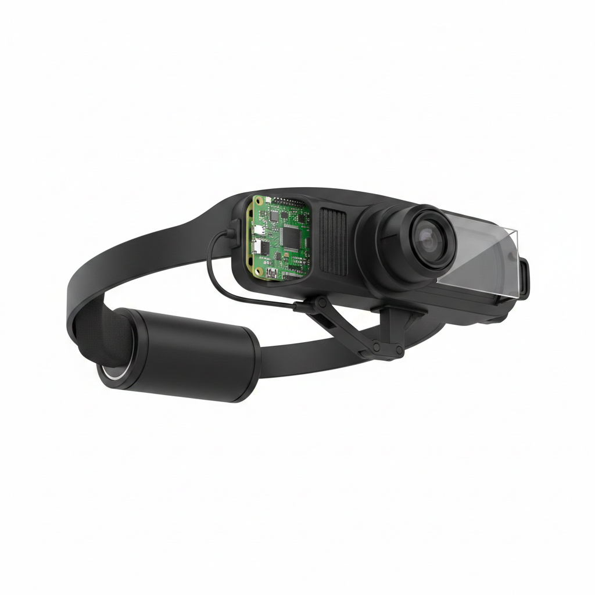

# ScouterHUD

**Scan any device. See its data. Open source AR for ~$85.**

An open-source wearable ecosystem that lets you see any device's data floating in front of your eye in real time — just by looking at its QR code. No screens. No touching. Hands free.

<p align="center">
  
  
  
</p>

---

## How it works

Every device has a small QR code. When you look at it through the ScouterHUD, the system connects automatically and shows live data overlaid on your vision.

```
You look at a QR          The HUD camera          Live data appears
on a patient    ────────► detects it and  ────────► in your field
monitor                   connects via MQTT        of vision
```

## The ecosystem

| Component | What it does | Cost |
|-----------|-------------|------|
| **ScouterHUD** | Monocular see-through display + camera + AI assistant | ~$55 |
| **ScouterApp** | Phone app mounted on forearm (landscape) — primary input: D-pad, PIN pad, device list | Free |
| **ScouterBridge** | Dongle that translates legacy devices (USB, OBD-II, Serial, BLE) to QR-Link | ~$8-15 |
| **ScouterGauntlet** | *(optional)* ESP32 wrist device with capacitive pads — for heavy gloves, IP67, no-phone use | ~$15 |

**Optional accessory: Tactile Overlay** — A silicone/TPU membrane with raised ridges placed over the phone screen. Lets you feel the buttons without looking. Works through medical gloves (nitrile). 3D-printed mold + cast silicone.

<p align="center">
  
  
</p>

## QR-Link Protocol

An open protocol we created for visual device discovery. A QR code contains a compact URL:

```
qrlink://v1/{device_id}/mqtt/{host}:{port}?auth={auth}&t={topic}
```

The HUD scans it, connects, fetches metadata from `$meta`, and renders the right layout automatically. It's like Bluetooth pairing, but visual.

**Security levels:** Open (public data) / PIN (entered silently via App or Gauntlet) / Token / Mutual TLS / Biometric

## Current status

The software is functional and tested end-to-end on desktop:

- **Device Emulator** — 5 simulated IoT devices publishing realistic data via MQTT
- **ScouterHUD Software** — QR scanning, MQTT transport, 6 device-specific layouts, preview mode
- **Input System** — Keyboard input with navigation and numeric modes (App/Gauntlet-ready architecture)
- **PIN Auth** — Interactive PIN entry screen with validation and retry
- **Multi-device** — Device history with switching (next/prev/list)
- **State Machine** — SCANNING > AUTH > CONNECTING > STREAMING > DEVICE_LIST > ERROR
- **116 Unit Tests** — Full coverage of protocol, auth, renderer, input, connection, gauntlet

Next: ScouterApp PoC (WebSocket + HTML control page), then hardware prototyping.

See [docs/STATUS.md](docs/STATUS.md) for detailed progress.

## Quick start

### Prerequisites

```bash
sudo apt install libzbar0
python3.12 -m venv .venv
cd emulator && ../.venv/bin/pip install -e . && cd ..
cd software && ../.venv/bin/pip install -e . && cd ..
```

### Run (3 terminals)

**Terminal 1 — MQTT Broker**
```bash
docker run --rm -p 1883:1883 eclipse-mosquitto:2 mosquitto -c /mosquitto-no-auth.conf
```

**Terminal 2 — Device Emulator**
```bash
cd emulator && ../.venv/bin/python emulator.py
```

**Terminal 3 — ScouterHUD**
```bash
cd software && PYTHONPATH=. ../.venv/bin/python -m scouterhud.main \
    --preview --demo monitor-bed-12 --broker localhost:1883 --topic ward3/bed12/vitals
```

Then open `/tmp/scouterhud_live.png` in any image viewer to see the HUD output live.

### Available demo devices

| Device | --demo | --topic | Type |
|--------|--------|---------|------|
| Patient monitor | `monitor-bed-12` | `ward3/bed12/vitals` | medical |
| Vehicle OBD-II | `car-001` | `vehicles/car001/obd2` | vehicle |
| Cloud server | `srv-prod-01` | `infra/prod/server01` | infra |
| Thermostat | `thermo-kitchen` | `home/kitchen/climate` | home |
| Hydraulic press | `press-machine-07` | `factory/zone2/press07` | industrial |

### Test PIN auth

```bash
cd software && PYTHONPATH=. ../.venv/bin/python -m scouterhud.main \
    --preview --demo monitor-bed-12 --broker localhost:1883 --topic ward3/bed12/vitals --auth pin
```

PIN for `monitor-bed-12` is `1234`. Controls: `w/s` change digit, `a/d` move cursor, `enter` submit, `x` cancel.

## Project structure

```
scouterHUD/
├── emulator/                    # Device Emulator Hub
│   ├── config.yaml              # 5 demo devices
│   ├── emulator.py              # MQTT publisher (asyncio)
│   ├── devices/                 # Medical, vehicle, infra, home, industrial
│   ├── generators/              # Realistic signal generators
│   └── generate_all_qrs.py     # QR code generator (PNG + PDF)
│
├── software/                    # ScouterHUD main software
│   ├── scouterhud/
│   │   ├── main.py              # Entry point + state machine
│   │   ├── display/             # Display backends (pygame, preview, SPI)
│   │   │   ├── renderer.py      # 6 layouts + status screens + device list
│   │   │   └── widgets.py       # Reusable UI components
│   │   ├── camera/              # Camera backends (desktop, Pi)
│   │   ├── qrlink/              # QR-Link protocol + MQTT transport
│   │   ├── input/               # Input system (keyboard, App/Gauntlet BLE)
│   │   └── auth/                # PIN auth flow
│   └── tests/                   # 116 unit tests (pytest)
│
├── app/                         # (planned) ScouterApp — phone companion
│   ├── web/                     # PoC: WebSocket + HTML control page
│   ├── flutter/                 # MVP: Flutter app (Android + iOS)
│   └── overlay/                 # Tactile overlay 3D models
│
├── docs/                        # Design docs + status
│   ├── STATUS.md
│   ├── ecosystem-overview.md
│   ├── app-tech-doc.md          # ScouterApp design
│   ├── bridge-tech-doc.md
│   └── gauntlet-tech-doc.md
│
├── gauntlet/                    # (optional) ESP32 firmware + hardware
└── bridge/                      # (planned) ESP32 firmware + hardware
```

## Hardware

| Component | ScouterHUD | ScouterApp | ScouterBridge | Gauntlet (optional) |
|-----------|-----------|-----------|---------------|---------------------|
| Processor | Raspberry Pi Zero 2W | Your phone | ESP32-S3 | ESP32-S3 |
| Display | 1.3" ST7789 240x240 | Phone screen | — | — |
| Battery | 18650 3000mAh (5-10 hrs) | Phone battery | Device-powered | LiPo 400mAh (5-7 days) |
| Connection | WiFi + BT | BLE/WiFi to HUD | WiFi/MQTT | BLE to HUD |
| Weight | ~150g | Phone + strap | ~15-25g | ~30g |

## Tech stack

| Layer | Technology |
|-------|-----------|
| HUD software | Python 3.12, Pillow, pygame, paho-mqtt, pyzbar |
| Emulator | Python 3.12, asyncio, paho-mqtt, qrcode, reportlab |
| Firmware (planned) | C++, PlatformIO, Arduino, ESP-IDF |
| Protocol | QR-Link (custom), MQTT, BLE GATT |
| Display | SPI (ST7789), beam splitter optics |

## Documentation

- [Project Status](docs/STATUS.md) — What's done, what's next, how to test
- [Ecosystem Overview](docs/ecosystem-overview.md) — The vision in plain language
- [ScouterApp Design](docs/app-tech-doc.md) — Phone companion app + tactile overlay
- [ScouterBridge Design](docs/bridge-tech-doc.md) — Universal device adapter
- [ScouterGauntlet Design](docs/gauntlet-tech-doc.md) — Optional wrist input device (ESP32)

## Why open source

Everything is public: hardware (3D models, schematics, PCBs), software, protocol, and docs. We believe the best way to make QR-Link a standard is to make it everyone's, not one company's. If the protocol is open, manufacturers adopt it without fear of lock-in. If the hardware is open, the community improves it faster than any internal team.

## License

- Software: MIT
- Hardware: CERN-OHL-S v2

---

*ScouterHUD is a project by Ger. Follow development on GitHub and LinkedIn.*
